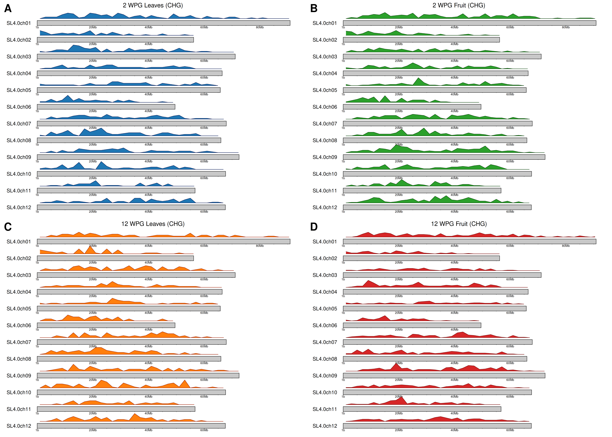

# Characterization-of-epigenomic-dynamics-of-tomato-
 DNA methylation and RNA sequencing assay for characterisation of (epi)genetic changes on BABA primed tomato plants

**Keywords**

DNA methylation, Whole genome bisulfite sequencing (WGBS), Methylation contexts in plants (CpG, CHG, CHH), Analysis of Differentially methylated region (DMR), Plant priming

**Objective(s)**

To characterize the epigenomic dynamics of tomato (Solanum lycopersicum) during fruit development and tissue differentiation, I created a comlete, strand-aware spatial methylome profiling pipeline. This workflow integrates differentially methylated regions (DMRs) in both CHH and CHG sequence contexts with transposable element (TE) structural annotations from the REPET database. The complete analysis quantifies family-specific TE targeting, genome-wide enrichment relative to background repeat abundance, and fine-scale spatial distribution relative to 5' transposon boundaries.
THe data was taken from the following study [1].

# Experimental setup

Investigation of DNA methylation profile of leaves and fruits of Solanum lycopersicum, from plants exposed to ß-aminobutyric (BABA) at two different developmental stages (2 weeks post germination, 12 weeks pst germination) or treated with water (control).

# Bioinformatics processing Pipeline**

The complete bioinformatics processing pipeline is shown on Figure 1. Complete flow was done in several phases, described in subsequent sections.

**Figure 1: Complete processing flow**

# Upstream data processing**

Upstream data processeing was done in usegalaxy platform. Upstream data processing included processing of raw reads obtained from [1] in following steps:
 - Download of reads from NCBI (Fasterq download)
 - Quality control (fastqc, multiqc)
 - Adapter trimming (Cutadapt, Trim Galore)
 - Reorganization of samples (Treated vs. control, 2 wpg vs. 12 wpg) 
 - Bisulfite genome alignment (bismarck, bwameth)
 - Methylation calling and extraction of metrics for CpG, CHG and CHH contexts (Methyldackel)

[MultiQC initial](https://droslj.github.io/Characterization-of-epigenomic-dynamics-of-tomato-/MultiQC_initial.html)

[MultiQC after adapter trimming](https://droslj.github.io/Characterization-of-epigenomic-dynamics-of-tomato-/MultiQC_post_T.html)

# Differential methylation analysis
Identification of DMR Genomic Regions (using metilene tool) identified differentially methylation regions for all relevant contexts (CpG, CHG and CHH). Final results were filtered for difference in methylation and adjusted p-value (|Δmeth| ≥ 10% (CpG, CHG), 20% (CHH); p adj. < 0.01)Pairwise genomic contrasts were conducted across developmental stages and tissue types (e.g., Fruit vs. Leaves at 2 WPG, Fruits: 2 vs. 12 WPG, Leaves vs. Fruits at 12 WPG, and Leaves: 2 vs. 12 WPG). DMRs were defined based on significant methylation differences across contiguous cytosines in CHH and CHG contexts. Genomic coordinates (chromosome, start, end, and strand) were recorded for each identified region.

**Figure 2: Genomic distribution map showing identified CpG counts across chromosomes for each developmental contrast**

**Figure 3: Genomic distribution map showing identified CHG DMR counts across chromosomes for each developmental contrast**

**Figure 4: Genomic distribution map showing identified CHH DMR counts across chromosomes for each developmental contrast**

# Functional gene annotation

To determine the potential regulatory impact of epigenomic variations identified across Solanum lycopersicum tissues and developmental stages, differentially methylated regions (DMRs) across CpG, CHG, and CHH contexts were mapped against genomic feature annotations (ITAG4.0 gene models). Additionally, obtained genes were extracted for pathway enrichment (see following section). Only genes that fall within  promoter region (i.e. < 2000 b.p.) were retained.

## Pathway enrichment

Genes obtained in the previous step were extracted and used for pathway enrichment (gProfiler). Results obtained are summarized in the Table 1'

**Table 1: Summary of pathway enrichment** 

**Comment on pathway enrichment**

1) CpG context
CpG Focuses on Seed/Embryo Maturation: The primary CpG epigenetic shifts during fruit transition (2 to 12 WPG Fruit) specifically target embryo and seed development (GO:0009790, GO:0009793, GO:0048316), matching the internal biological shifts of ripening tomato fruits preparing for seed dormancy.

2) CHH context
CHH Focuses on Membrane & Stress Signaling: CHH changes dynamically target cell surface signaling (plasma membrane and cell periphery) during fruit maturation, as well as broader stress responsiveness (cellular response to stimulus) during early tissue differentiation.

# Genomic Feature Distribution

Genomic feature distribution for all three contexts were extracted from data. Genomic feature distrobution shows percentage of total DMRs falling into each genomic feature category and is shown on Figures 5 - 7.

**Figure 5: Genomic feature distribution for CpG context**

**Figure 6: Genomic feature distribution for CHG context**

**Figure 7: Genomic feature distribution for CHH context**

**Observation on genomic feature distribution** 
 
Ad 1) Intergenic Dominance Across All Contexts 
Across CpG, CHG, and CHH DMR sets, intergenic sequences represent the largest single category, consistently capturing between 60 and 80% of all differentially methylated regions. This robust intergenic skew reflects large-scale developmental remodeling within transposon-rich and non-coding heterochromatic domains of the tomato genome. 
 
Ad 2) Non-CG (CHH and CHG) Enrichment in Repetitive Spaces  
The CHH and CHG contexts exhibit a heavy restriction to intergenic spaces with minimal representation in coding exons (< 5%). This strongly conforms to canonical RNA-directed DNA methylation (RdDM) and CMT-mediated maintenance pathways, which target transposable elements and repetitive intergenic regions to maintain genome stability without disrupting protein-coding transcription. 
 
Ad 3) Gene-Body and Intronic Integration in CpG Methylation  
In contrast to non-CG contexts, the CpG DMR distributions display a much higher relative abundance within intronic regions (~15-30%) and promoter zones (< 2kb). This structural partitioning matches the expected functional role of symmetrical CG methylation, which frequently populates gene bodies and regulatory interfaces to modulate transcriptional activity and alternative splicing during plant development. 
 
Ad 4) Developmental and Tissue-Specific Plasticity 
The consistent proportional stability across leaf and fruit comparisons (both 2 vs. 12 WPG) demonstrates that while specific loci undergo targeted methylation changes during tissue maturation and organogenesis, the global genomic compartments targeted by epigenetic modifiers remain tightly conserved. 
 
# Mapping DMRs to REPET Annotations

Identified DMRs were mapped to genomic repeats using structural annotations generated by the REPET pipeline. Spatial intersections were computed using bedtools intersect, capturing both direct physical overlaps (Distance = 0 bp) and proximal flanking relationships (up to 2000 bp upstream/downstream). Transposons were classified into structural categories, including Class I LTR (Copia, Gypsy), Class I non-LTR (LINE, SINE), Class II (Helitron), Host Gene Exons/Fragments, and Unclassified / Degraded elements.

[INSERT IMAGE PLACEHOLDER 2: DMR-REPET Intersection Scheme]

Caption: Schematic representation of bedtools spatial overlap mapping DMR coordinates onto REPET-annotated full-length and truncated transposon bodies.

Step 3: DMR Distribution by REPET Feature Category
Quantification of DMR occurrences across REPET feature categories revealed distinct targeting preferences between cytosine contexts. While CHH DMRs preferentially localized near truncated remnants and LTR elements, CHG DMRs showed broader distribution across degraded repeat fragments, host gene exons, and Helitrons.
[INSERT IMAGE PLACEHOLDER 3: DMR Distribution Across REPET Categories Bar Charts]
Caption: Categorical bar plots displaying total DMR counts grouped by REPET feature classes across CHH and CHG contexts.

Step 4: Whole-Genome Background Enrichment Analysis
To determine whether dynamic methylation non-randomly targets specific repeat families, hypergeometric enrichment testing was conducted against the whole-genome REPET background. Observed DMR counts per TE category were compared against total genome-wide REPET feature frequencies. This step established statistically significant enrichment (p < 0.05) for truncated/degraded repeat fragments and specific LTR subfamilies relative to background genomic expectations.
[INSERT IMAGE PLACEHOLDER 4: Hypergeometric Enrichment Analysis Plots]
Caption: Fold-enrichment heatmaps and statistical significance (-log10 p-values) comparing observed DMR-TE associations against whole-genome background distribution.

Step 5: Spatial Metaplot Analysis Around 5' TE Boundaries
To resolve the precise spatial targeting of methylation relative to transposon architecture, distance vectors were computed from each DMR center to the 5' insertion edge of the nearest TE.
To maintain biological orientation across both forward (+) and reverse (-) strand transposons, a strand-aware coordinate transformation was applied:
Distance = IF(Strand = "-", REPET_End - DMR_Start, DMR_Start - REPET_Start)

Under this framework:
Negative distances (-1000 to -1 bp): Represent the 5' euchromatic outer flank (5' promoter-proximal region).
Zero (0 bp): Represents the physical insertion boundary.
Positive distances (+1 to +2000 bp): Represent internal regions within the TE body.
Calculated distances were grouped into 100 bp continuous bins spanning -1000 bp to +2000 bp using standardized PivotTable parameters (Show items with no data enabled; empty bins set to 0). Line-graph metaplots were generated for each contrast, revealing a sharp, RdDM-driven boundary peak at 0–100 bp in the CHH context versus a broad, internal body distribution (+200 to +1200 bp) in the CHG context.
[INSERT IMAGE PLACEHOLDER 5: Publication Metaplot Figure Grid (CHH vs. CHG)]
Caption: Comparative 4-panel line metaplots displaying spatial DMR density around 5' TE boundaries (-1000 bp to +2000 bp) across developmental contrasts for CHH (left panel set) and CHG (right panel set) contexts.

**References**
[1] Developmentally regulated generation of a systemic signal for long-lasting defence priming in tomato [WGBS], Project PRJNA1144133, NCBI (https://www.ncbi.nlm.nih.gov/bioproject/PRJNA1144133)
