# Characterization-of-epigenomic-dynamics-of-tomato-
 DNA methylation and RNA sequencing assay for characterisation of (epi)genetic changes on BABA primed tomato plants

**Keywords**

DNA methylation, Whole genome bisulfite sequencing (WGBS), Methylation contexts in plants (CpG, CHG, CHH), Analysis of Differentially methylated region (DMR), Plant priming, Transposable elements

**Objective(s)**

To characterize the epigenomic dynamics of tomato (Solanum lycopersicum) during fruit development and tissue differentiation, I created a comlete, strand-aware spatial methylome profiling pipeline. This workflow integrates differentially methylated regions (DMRs) in both CHH and CHG sequence contexts with transposable element (TE) structural annotations from the REPET database. The complete analysis quantifies family-specific TE targeting, genome-wide enrichment relative to background repeat abundance, and fine-scale spatial distribution relative to 5' transposon boundaries.
The data was taken from the following study [1].

# Experimental setup

Investigation of DNA methylation profile of leaves and fruits of Solanum lycopersicum, from plants exposed to ß-aminobutyric (BABA) at two different developmental stages (2 weeks post germination, 12 weeks pst germination) or treated with water (control).

# Bioinformatics processing Pipeline

The complete bioinformatics processing pipeline is shown on Figure 1. Complete flow was done in several phases, described in subsequent sections.

**Figure 1: Complete processing flow**

# Upstream data processing

Upstream data processeing was done in usegalaxy platform. Upstream data processing included processing of raw reads obtained from [1] in following steps:
 - Download of reads from NCBI (Fasterq download)
 - Quality control (fastqc, multiqc)
 - Adapter trimming (Cutadapt, Trim Galore)
 - Reorganization of samples (Treated vs. control, 2 wpg vs. 12 wpg) 
 - Bisulfite genome alignment (bismarck, bwameth)
 - Methylation calling and extraction of metrics for CpG, CHG and CHH contexts (Methyldackel)

[MultiQC initial](https://droslj.github.io/Characterization-of-epigenomic-dynamics-of-tomato-/MultiQC_initial.html)

[MultiQC after adapter trimming](https://droslj.github.io/Characterization-of-epigenomic-dynamics-of-tomato-/MultiQC_post_T.html)

# Differential methylation analysis

Calling differentially methylated regions (using metilene tool) identified DMRs for all relevant contexts (CpG, CHG and CHH). Pairwise genomic contrasts were conducted across developmental stages and tissue types (e.g., Fruit vs. Leaves at 2 WPG, Fruits: 2 vs. 12 WPG, Leaves vs. Fruits at 12 WPG, and Leaves: 2 vs. 12 WPG). Final results were filtered for difference in methylation and adjusted p-value (|Δmeth| ≥ 10% (CpG, CHG), 20% (CHH); p adj. < 0.01). DMRs were defined based on significant methylation differences across contiguous cytosines in CHH and CHG contexts. Genomic coordinates (chromosome, start, end, and strand) were recorded for each identified region. 

## Chromosomal DMR distribution map

Using results from previous step, Chromosomal DMR distribution map for all three contexts was extracted (Figures 2 - 4).

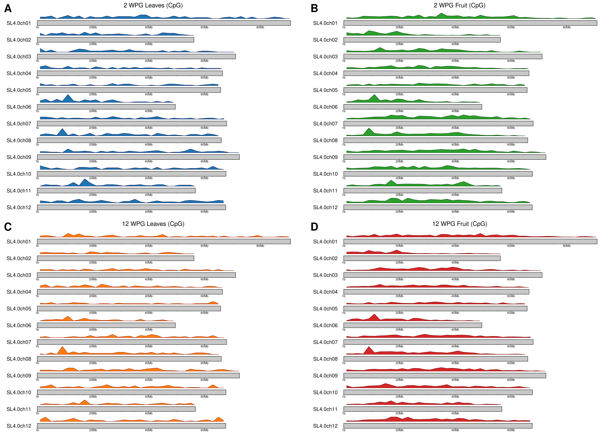

 

**Figure 2: Genomic distribution map showing identified CpG counts across chromosomes for each developmental contrast**
 

 

**Figure 3: Genomic distribution map showing identified CHG DMR counts across chromosomes for each developmental contrast**
 

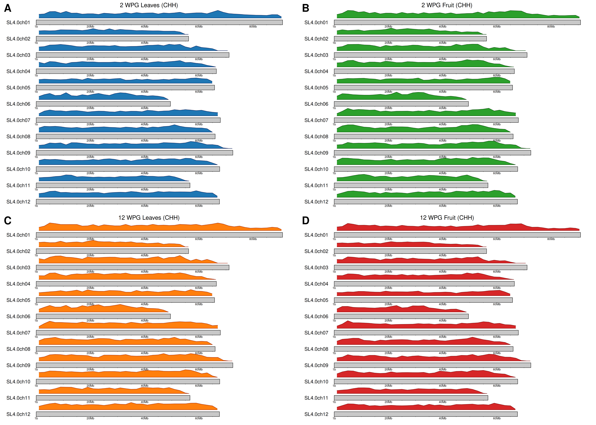
 
**Figure 4: Genomic distribution map showing identified CHH DMR counts across chromosomes for each developmental contrast**
 
 

# Functional gene annotation
 
To determine the potential regulatory impact of epigenomic variations identified across Solanum lycopersicum tissues and developmental stages, differentially methylated regions (DMRs) across CpG, CHG, and CHH contexts were mapped against genomic feature annotations (ITAG4.0 gene models). Additionally, obtained genes were extracted for pathway enrichment (see following section). Only genes that fall within  promoter region (i.e. < 2000 b.p.) were retained.
 

## Pathway enrichment
  
Genes obtained in the previous step were extracted and used for pathway enrichment (gProfiler). Results obtained are summarized in the Table 1'. 
 

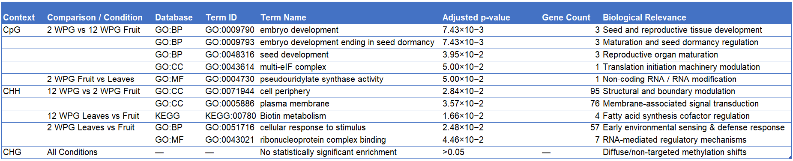

**Table 1: Summary of pathway enrichment**  
 
**Observations** 

CpG context focuses on Seed/Embryo Maturation. The primary CpG epigenetic shifts during fruit transition (2 to 12 WPG Fruit) specifically target embryo and seed development (GO:0009790, GO:0009793, GO:0048316), matching the internal biological shifts of ripening tomato fruits preparing for seed dormancy. 
 
CHH context focuses on Membrane & Stress Signaling. CHH changes dynamically target cell surface signaling (plasma membrane and cell periphery) during fruit maturation, as well as broader stress responsiveness (cellular response to stimulus) during early tissue differentiation. 
 
CHG context didn't provide any significantly enriched pathways. 
 
# Genomic Feature Annotation and Distribution 
 
Genomic feature distribution of differentially methylated contexts comparing experimental factors (Factor 1 - Tisue: Leaf vs. Fruit, Factor 2 - time after germination: 2 vs. 12 weeks) for all three contexts were extracted from data by intersecting with gff gene model (ITAg4.0_gene_models.gff). Spatial intersections were computed using bedtools intersect, capturing both direct physical overlaps (Distance = 0 bp) and proximal flanking relationships (up to 2000 bp upstream/downstream) for all three contexts Genomic feature distribution shows percentage of total DMRs falling into each genomic feature category and is shown on Figures 5 - 7. 
 

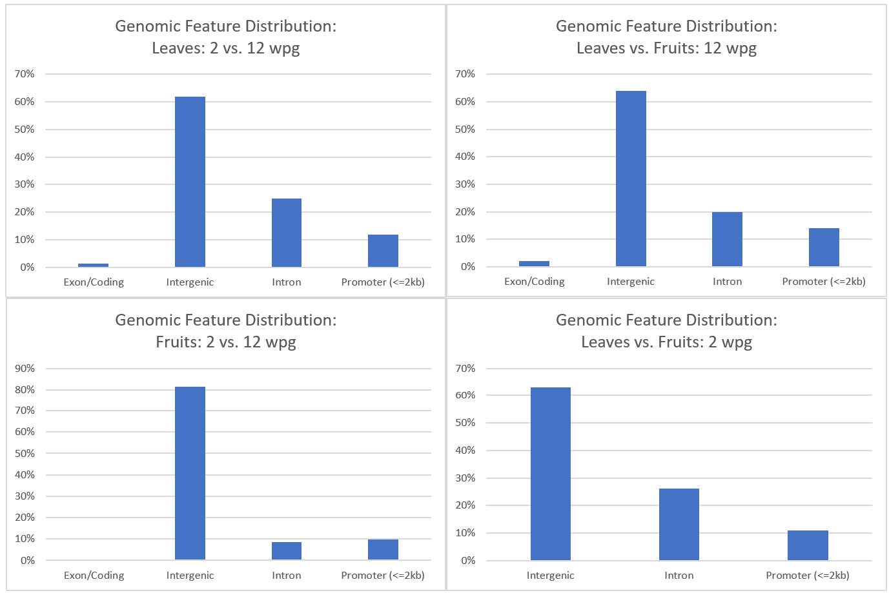

**Figure 5: Genomic feature distribution for CpG context**

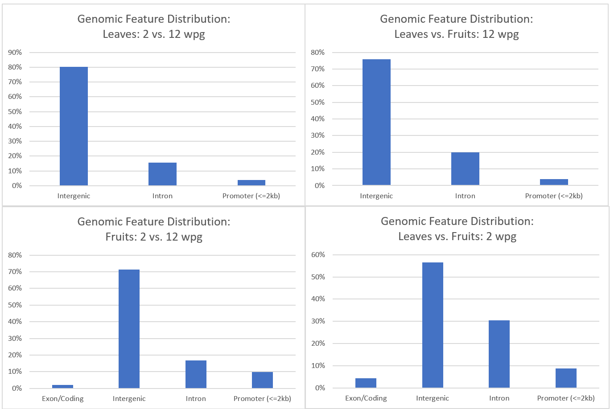

**Figure 6: Genomic feature distribution for CHG context**

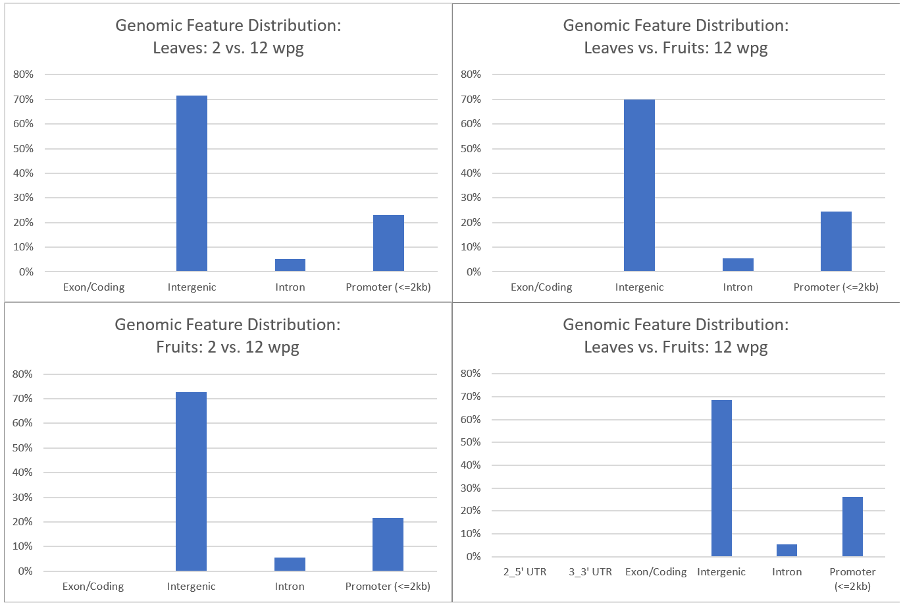

**Figure 7: Genomic feature distribution for CHH context**

 

**Observations** 

**Overall observation** 
The distribution of genomic features shown in the images suggests a strong noncoding/intergenic bias in differentially methylated regions (DMRs), especially for CHG and CHH methylation. That pattern is biologically plausible in tomato because intergenic regions are rich in repetitive DNA and transposable elements, which are major targets of plant DNA-methylation pathways.  

**Intergenic enrichment** 
Roughly 60–80% of DMRs fall in intergenic sequences. This is consistent with methylation changes occurring in transposon-rich or heterochromatic regions rather than primarily inside protein-coding exons. 

**CHG and CHH contexts** 
Their low representation in exons and stronger association with intergenic regions fits the expected behavior of non-CG methylation. CHH methylation is commonly associated with RNA-directed DNA methylation (RdDM) and transposon silencing, while CHG methylation is often maintained by CMT3-related pathways. 

**CpG context** 
The relatively greater representation of CpG DMRs in introns and promoter-proximal regions is also plausible. CpG methylation can occur within gene bodies and regulatory regions, where it may be associated with transcriptional regulation or, in some cases, alternative splicing. 

**Low exon overlap** 
Fewer than 5% of CHG and CHH DMRs overlapping coding exons suggests that methylation remodeling may avoid directly altering protein-coding regions. 
 

# Transposable element Feature Annotation and distribution 
 
Similarly as with the genomic feature distribution, identified DMRs were mapped to genomic repeats by intersecting with REPET annotation (ITAG4.0_REPET_repeats_aggressive.gff). Transposons were classified into structural categories, including Class I LTR (Copia, Gypsy), Class I non-LTR (LINE, SINE), Class II (Helitron), Host Gene Exons/Fragments, and Unclassified / Degraded elements. 
 

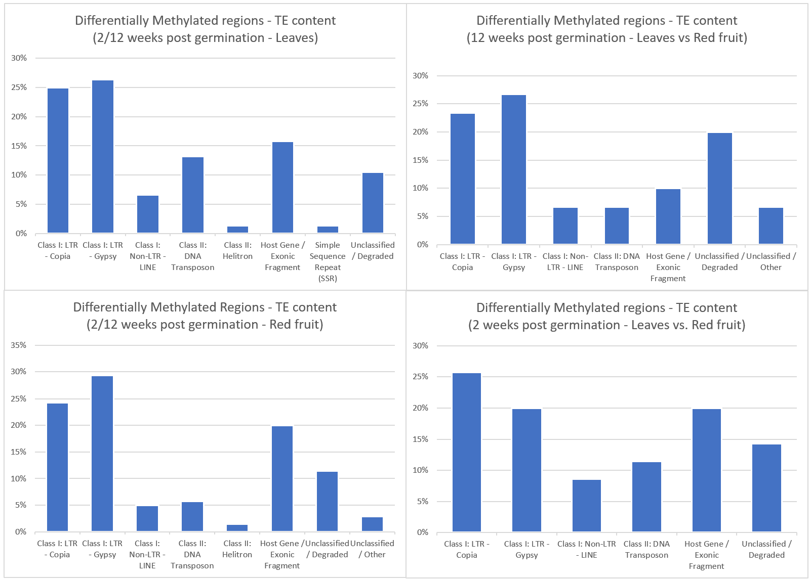

**Figure 8: Transposable feature content for CHG context**

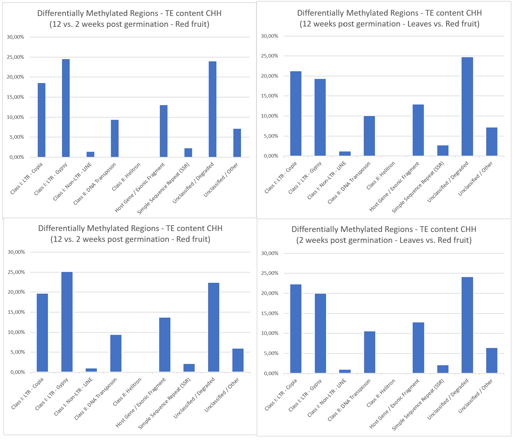

**Figure 9: Transposable feature content for CHH context**
 

**Observations** 

**CHH DMRs near LTRs and truncated/degraded repeats** 
This is consistent with CHH methylation being involved in active or RNA-directed transposon control. CHH methylation is more dynamic than CHG methylation, so it may respond strongly to BABA treatment or developmental changes. 

**CHG DMRs distributed across several repeat categories**  
The broader CHG distribution including degraded repeats, Helitrons, and host-gene/exonic repeat fragments suggests that CHG changes are not restricted to intact LTR elements. This could reflect maintenance or remodeling of methylation across older, fragmented, and gene-proximal repeats. 

**Copia and Gypsy representation**  
Finding both LTR superfamilies is reasonable because they are abundant in plant genomes. However, their presence among DMRs does not by itself demonstrate preferential targeting. That conclusion depends on the whole-genome background enrichment analysis. 

**Degraded or unclassified repeats** 
These categories should not be dismissed as uninformative. They may represent old TE insertions that have accumulated mutations but retain regulatory or chromatin effects. However, they are also more vulnerable to annotation ambiguity and fragmented interval definitions. 
 

# Integration of Genomic Features and Transposable Elements

Direct intersection between genomic DMR intervals and the ITAG4.0_REPET_repeats_aggressive.gff repeat annotation files provides  DMR overlap across all transposable element superfamilies (Copia, Gypsy, Helitrons, LINEs, etc.) that were identified by the REPET pipeline. 

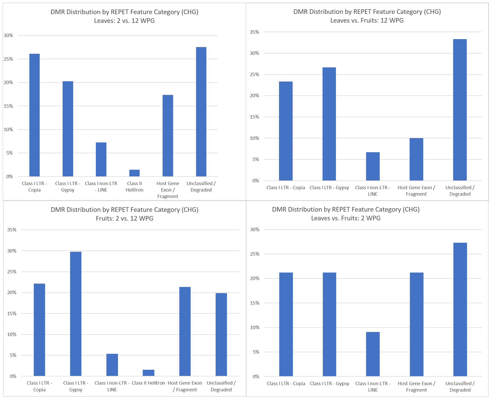

**Figure 10: DMR Distribution Across REPET Categories for CHG context**

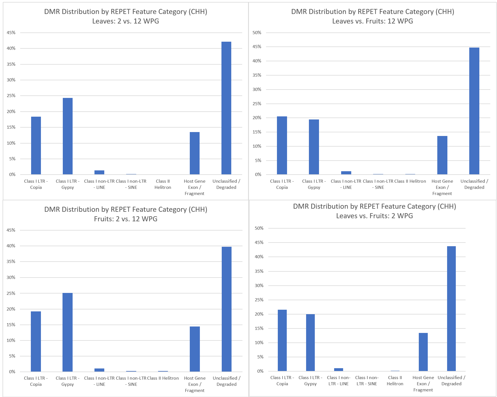

**Figure 11: DMR Distribution Across REPET Categories for CHH context**

**Observations**
 
**Non-CG Enrichment at Repeats and Intergenic Regions** 
CHG and CHH DMRs heavily skew toward transposable elements and intergenic spaces, reflecting active, localized maintenance of heterochromatic silencing and repeat suppression via the RNA-directed DNA methylation (RdDM) pathway. 

**Proximity at Gene-TE Boundaries** 
The distance filter (< 2,000 bp upstream and gene bodies) reveals that a targeted subset of non-CG DMRs localizes to repetitive elements situated within proximal promoter regions or long introns. 

**Superfamily Target Profiles** 
Across the analyzed transposable element intersections, LTR retrotransposons (predominantly Copia and Gypsy superfamilies) capture the majority of non-CG differential methylation events. 
 
# Whole-Genome Background Enrichment Analysis 

To determine whether dynamic methylation non-randomly targets specific repeat families, hypergeometric enrichment testing was conducted against the whole-genome REPET background. Observed DMR counts per TE category were compared against total genome-wide REPET feature frequencies. This step established statistically significant enrichment (p < 0.05) for truncated/degraded repeat fragments and specific LTR subfamilies relative to background genomic expectations.

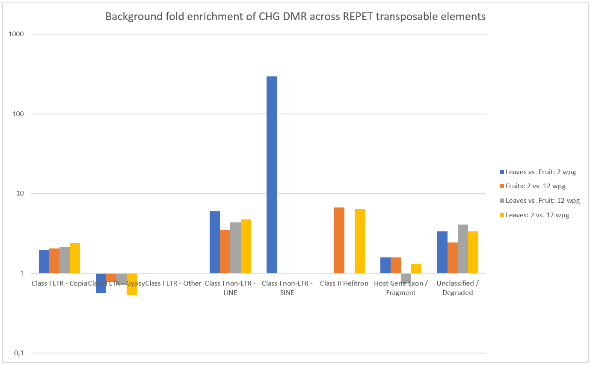

**Figure 12: Whole genome background enrichment (CHG context)**

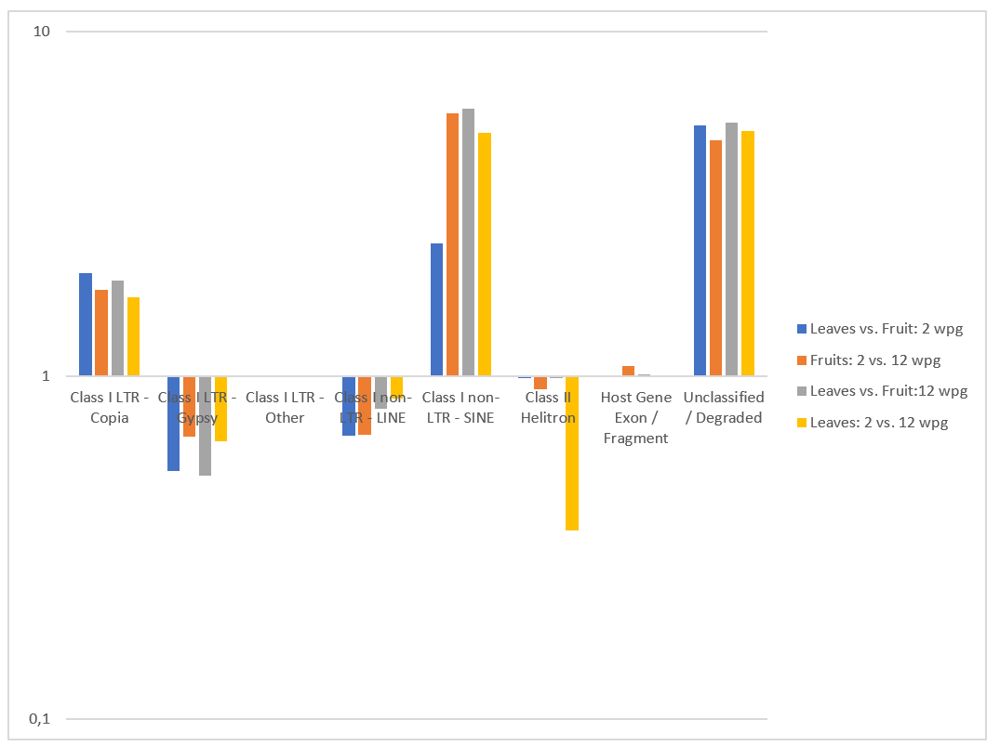

**Figure 13: Whole genome background enrichment (CHH context)**

**Observations** 

Observations are summarized in Table 2 

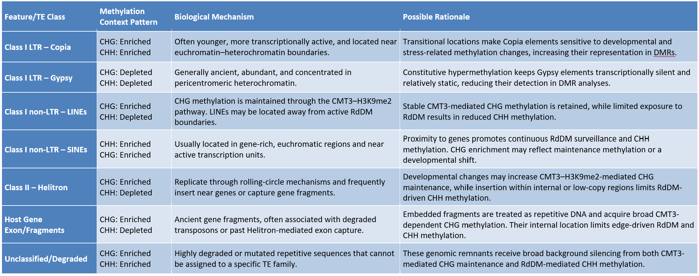

**Table 2: Observation on background enrichment**

# Spatial Metaplot Analysis Around 5' TE Boundaries
 
To examine the spatial distribution of methylation changes relative to transposable elements, the distance from each DMR center to the nearest 5′ TE annotation boundary was calculated. Coordinates were transformed according to TE strand so that the same biological orientation was maintained for elements on both the forward and reverse strands. Negative distances represent the 1-kb region upstream of the 5′ TE boundary, zero represents the boundary, and positive distances represent positions within the TE body. Distances were summarized in consecutive 100-bp bins from −1 kb to +2 kb. 
 
Peaks near the boundary would indicate a spatial concentration of DMRs at or near the TE edge, whereas a more uniform distribution across positive distances would suggest methylation changes throughout the TE body. CHH boundary enrichment would be consistent with localized RdDM-associated regulation, while CHG enrichment may reflect maintenance methylation or chromatin remodeling. These interpretations should be evaluated against a matched genomic background and supported by confidence intervals, bin-level counts, and separate analyses for major TE classes. 
 
Figures 14 and 15 show strand-aware spatial distribution of CHG/CHH DMR centers relative to the 5′ boundary of the nearest transposable element. Negative distances indicate the upstream flanking region, zero indicates the TE annotation boundary, and positive distances indicate positions within the TE body. 
Values are summarized in 100-bp bins.

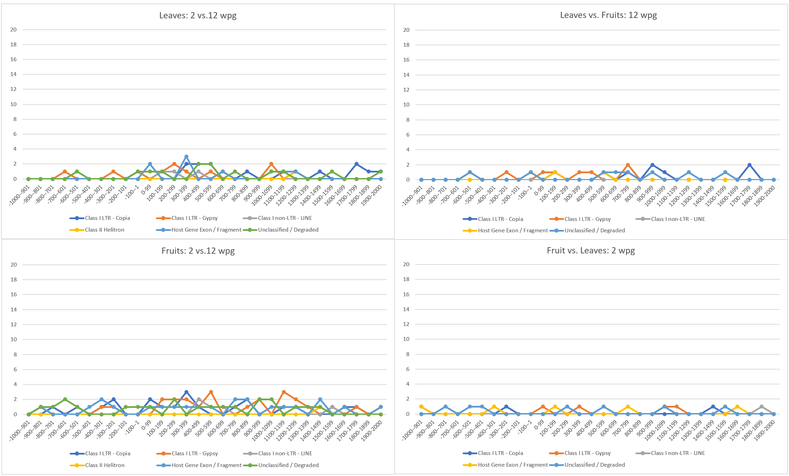

**Figure 14: Spatial metaplot (CHG context)**

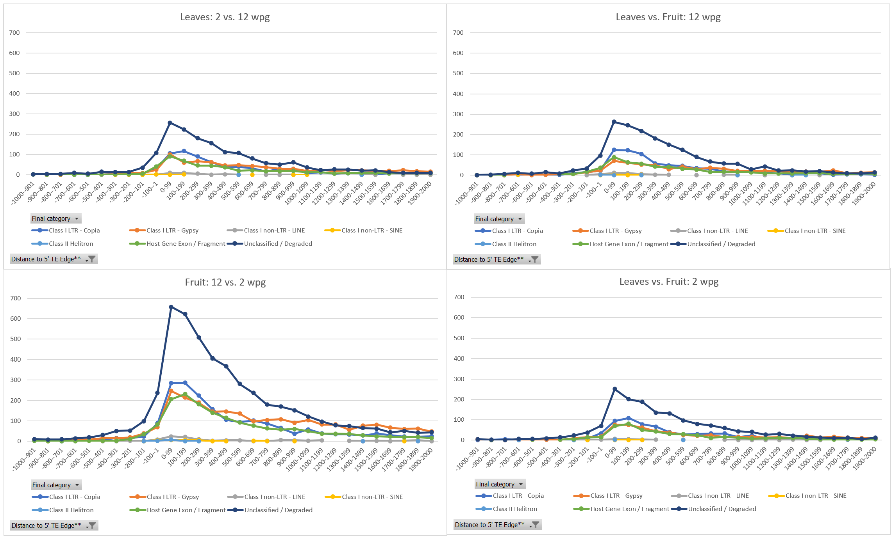

**Figure 15: Spatial metaplot (CHH context)**

 
**References** 
[1] Developmentally regulated generation of a systemic signal for long-lasting defence priming in tomato [WGBS], Project PRJNA1144133, NCBI (https://www.ncbi.nlm.nih.gov/bioproject/PRJNA1144133)
